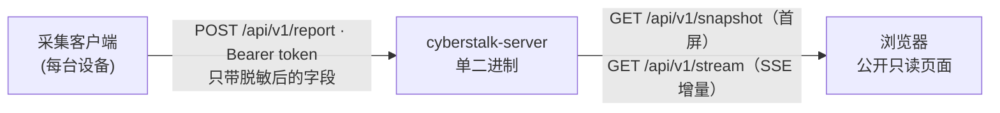

<div align="center">


# cyberstalk-me · 赛博视奸

**把「我现在在干嘛」做成一个公开网页。**
设备上报已在本地脱敏的活动摘要，服务端汇总后推给所有访客，页面近实时更新。

[](https://github.com/Sallyn0225/cyberstalk-me/actions/workflows/ci.yml)
[](https://github.com/Sallyn0225/cyberstalk-me/actions/workflows/release.yml)
[](https://github.com/Sallyn0225/cyberstalk-me/pkgs/container/cyberstalk-me)
[](https://go.dev)
[](https://react.dev)

</div>

---

## 它是什么

一个自部署的「在线状态」页面。你的设备上跑一个小客户端，定时把「用哪个应用、在干什么、
是否挂机、电量、网络」上报到你自己的服务器；访客打开网页，就能近实时地看到这些卡片。

- **单二进制部署** — Go 服务端内嵌前端与 SQLite，没有配置文件，全部走环境变量；持久化状态只有一个 `.db` 文件。
- **设备端脱敏** — 原始窗口标题、进程路径永远不出设备，上报的只有映射后的结果（`VS Code · 在写代码`）。
- **近实时推送** — 首屏 `GET /api/v1/snapshot`，之后靠 SSE 增量推，页面不轮询。
- **离线自动判定** — 设备静默超过阈值，服务端主动广播 `offline`，卡片自己变灰。
- **一条命令上线** — 预构建多架构镜像（`linux/amd64` + `linux/arm64`），部署机不需要装 Go 和 Node。
- **token 一次性发放** — 每台设备一个独立 token，服务端只存 SHA-256 哈希，明文只打印一次。

## 脱敏红线

这个项目的安全性完全建立在一件事上：**原始窗口标题不离开设备**。三条规则保证它成立：

1. **只在规则需要时才读标题** — 只有配了 `title_patterns` 的规则或 `expose_title` 白名单会去读；一条标题规则都没配的部署，根本不会读取标题。
2. **没匹配上规则的进程只报通用描述**（`某个应用 · 使用中`），绝不报 exe 名——exe 名本身就可能泄露信息（内部工具、项目代号）。想显示？去写规则。
3. **原始标题只在一次映射调用的内存里存在**，不进上报体、不进日志（哪怕 `-v`）、不进 `-dry-run` 输出、不落盘。

> [!WARNING]
> `expose_title` 是唯一的显式退出机制：列在里面的进程会把**原始窗口标题原样公开上报**。
> 默认为空，除非你真的清楚自己在做什么，否则别动它。

客户端提供了 `-dry-run`：采集并映射一轮，把「将要发送的脱敏载荷」打印到 stdout 后退出，不联网。
配完规则先跑这个，用一个诱饵标题（比如把浏览器标签命名为 `SECRET-TITLE-CANARY`）确认它没有出现在输出里。
完整说明见 [`client-windows/README.md`](client-windows/README.md)。

## 架构



服务端一个进程干三件事：HTTP API、SSE 广播（in-process hub，无外部消息队列）、SQLite 读写；
前端构建产物通过 `//go:embed` 编进同一个二进制。前后端与客户端共用 [`shared/contract.go`](shared/contract.go)
里的数据契约——那是线上格式的唯一真源，且刻意不包含原始标题与 token 字段，让未脱敏数据在类型层面就无处安放。

### HTTP API

| 端点 | 认证 | 说明 |
|------|------|------|
| `POST /api/v1/report` | `Authorization: Bearer <设备 token>` | 上报一次状态，成功返回 `204`。body 里的 `device_id` 必须与 token 绑定的设备一致 |
| `GET /api/v1/snapshot` | 公开 | 所有上报过的设备当前状态（JSON 数组），首屏用；也是容器健康检查的探测点 |
| `GET /api/v1/stream` | 公开 | SSE 流，事件类型 `ready` / `update` / `offline` |

设备的在线判定一律用**服务端时钟**（`last_seen_at`），客户端自报的 `reported_at` 只用于展示与排查，
所以客户端时间跑偏不会影响在线状态。

## 快速部署

只需要 Docker 和 Docker Compose plugin，别的都不用装（镜像是预构建的）。

```bash
git clone https://github.com/Sallyn0225/cyberstalk-me.git
cd cyberstalk-me
docker compose up -d
```

打开 `http://<你的服务器>:8080` 就能看到页面——此时还没有任何设备，是空的。

想改端口之类的，复制一份配置再改：

```bash
cp .env.example .env      # 编辑 HOST_PORT / IMAGE_TAG / OFFLINE_THRESHOLD / SCAN_INTERVAL
docker compose up -d
```

不复制 `.env` 也能跑——文件里写的值就是内置默认值，它存在的意义是把可调项写清楚。

### 镜像标签

镜像发布在 GHCR：`ghcr.io/sallyn0225/cyberstalk-me`，支持 `linux/amd64` 与 `linux/arm64`。

| 标签 | 内容 |
|------|------|
| `latest` | 最新发布版本（推荐） |
| `0.1.0` / `0.1` | 指定版本 / 指定次版本线 |
| `edge` | `main` 分支最新提交，尝鲜用 |

## 注册设备

每台要上报的设备都得先在服务端注册，拿一个专属 token：

```bash
docker compose exec app cyberstalk-server register-device win-desktop "我的台式机" windows
```

三个参数分别是设备 ID（英文短名，客户端配置要用）、显示名（页面上看到的）、类型（`windows` 或 `android`）。
输出长这样，最后四行可以直接粘进客户端配置：

```
Device registered. This token is shown ONCE — copy it now:

  token: 3f8a...（64 位十六进制）

Client config (config.yaml):

  server_url: http://localhost:8080
  device_id: win-desktop
  token: 3f8a...
  interval: 10s
```

加 `--server-url` 让打印出来的 `server_url` 直接是对外地址：

```bash
docker compose exec app cyberstalk-server register-device win-desktop "我的台式机" windows \
  --server-url https://your.domain.com
```

> [!IMPORTANT]
> **token 只打印这一次**，服务端只存它的哈希，没有任何办法找回。
> 弄丢了就用同一个设备 ID 再 `register-device` 一次，会换发一个新 token（旧的随即失效）。

## 接上客户端

把上面打印的 `server_url` / `device_id` / `token` / `interval` 四行粘进客户端的 `config.yaml`
（从 [`client-windows/config.example.yaml`](client-windows/config.example.yaml) 复制一份改），补上你的映射规则，然后跑起来：

```bash
# 先干跑一轮，确认没有敏感信息泄漏
./agent.exe -config ./config.yaml -dry-run

# 确认无误后常驻
./agent.exe -config ./config.yaml
```

构建方式、映射规则语法、开机自启（注册表 Run 键）、断线退避策略见 [`client-windows/README.md`](client-windows/README.md)。

> [!WARNING]
> `config.yaml` 里有 token，按密码对待：不要提交进 git（仓库已忽略 `client-windows/config*.yaml`），
> 并收紧文件 ACL 只让自己可读。

## 配置项

服务端没有配置文件，只认环境变量。

| 变量 | 默认值 | 说明 |
|------|--------|------|
| `ADDR` | `:8080` | 监听地址。容器里固定 `:8080`，改端口请改宿主机侧 |
| `SQLITE_PATH` | 容器内 `/data/cyberstalk.db` | SQLite 文件路径，唯一的持久化状态 |
| `OFFLINE_THRESHOLD` | `60s` | 设备静默多久后判为离线。接受 Go duration（`90s`、`2m30s`）或纯秒数（`90`） |
| `SCAN_INTERVAL` | `5s` | 扫描离线设备的间隔，决定「设备静默」到「页面变灰」的最坏延迟 |

compose 额外读两个变量：`HOST_PORT`（宿主机发布端口，默认 `8080`）与 `IMAGE_TAG`（镜像标签，默认 `latest`）。
值填错不会静默降级——比如 `OFFLINE_THRESHOLD` 写了个解析不了的值，服务会在启动时直接报错退出。

## 放到域名后面

compose 只暴露一个 HTTP 端口，TLS 和域名交给你自己的反向代理。

> [!CAUTION]
> **唯一必须注意的是 SSE。** 页面靠 `GET /api/v1/stream` 做实时更新，反代如果开着响应缓冲，
> 事件会被攒在缓冲区里发不出去，表现为「页面能打开但永远不更新」。后端已经发了
> `X-Accel-Buffering: no`，但 nginx 的 `proxy_buffering` 仍需显式关闭。

<details>
<summary><b>nginx</b></summary>

```nginx
location / {
    proxy_pass http://127.0.0.1:8080;
    proxy_http_version 1.1;
    proxy_set_header Host              $host;
    proxy_set_header X-Real-IP         $remote_addr;
    proxy_set_header X-Forwarded-For   $proxy_add_x_forwarded_for;
    proxy_set_header X-Forwarded-Proto $scheme;

    # SSE 的三行，别省
    proxy_buffering     off;
    proxy_cache         off;
    proxy_read_timeout  1h;
}
```

</details>

<details>
<summary><b>Caddy</b></summary>

```caddyfile
your.domain.com {
    reverse_proxy 127.0.0.1:8080 {
        flush_interval -1     # 不缓冲，SSE 逐条下发
    }
}
```

</details>

上了反代之后，建议把 `HOST_PORT` 改成只监听本机（如 `127.0.0.1:8080`），别让 8080 直接暴露在公网。

## 日常运维

```bash
docker compose ps                 # 含健康检查状态
docker compose logs -f app        # 结构化 JSON 日志
docker compose pull && docker compose up -d   # 升级；数据在具名卷里，不会丢
```

**备份**——只有一个 SQLite 文件要备份。为了拿到一致快照，先停再拷：

```bash
docker compose stop app
docker compose cp app:/data/cyberstalk.db ./cyberstalk-backup.db
docker compose start app
```

**卸载**：

```bash
docker compose down        # 停服务，保留数据
docker compose down -v     # 连数据卷一起删（设备和 token 全没了，不可恢复）
```

## 本地开发

需要 Go 1.26+ 与 Node 24+。不用 Docker 也能跑：

```bash
cd server && go run ./cmd/server      # 默认 :8080，数据库落在 ./cyberstalk.db
```

前端 dev server（已把 `/api` 代理到 `:8080`）与主题定制见 [`web/README.md`](web/README.md)。
想自己构建镜像而不是拉预构建的：`docker compose build && docker compose up -d`。

质量门禁，与 CI 跑的完全一致：

```bash
gofmt -l shared server client-windows
go vet  ./server/... ./shared/...
go test ./server/... ./shared/...
cd web && npm ci && npm run lint && npm run typecheck && npx vitest run && npm run build
```

> [!IMPORTANT]
> **改了 `web/` 下的任何东西，都必须 `npm run build` 并把 `server/cmd/server/web/` 的产物一起提交。**
>
> `vite build` 的输出直接写进那个目录，也就是 Go 二进制 `//go:embed` 的目录——产物不新鲜，
> 二进制就会静默地继续服务旧界面。CI 的 `web` job 会重新构建并 diff 该目录，不新鲜直接失败。

`go.work` 的存在让仓库根目录下的裸 `go build ./...` 无法工作（`client-windows` 是 Windows-only 模块），
所以上面每条命令都显式点名模块；构建客户端请用 `cd client-windows && go build -o agent.exe ./cmd/agent`。

## 项目结构

| 目录 | 内容 |
|------|------|
| `server/` | Go 后端：HTTP API、SSE hub、SQLite store、离线状态跟踪、内嵌前端 |
| `web/` | React 19 + Vite + Tailwind v4 前端，构建产物写进 `server/cmd/server/web/` |
| `client-windows/` | Windows 上报客户端，含脱敏映射规则引擎 |
| `shared/` | 前后端与客户端共用的数据契约，唯一真源，只有类型没有逻辑 |
| `.trellis/` | 开发流程与分层编码规范（`spec/`）、任务归档 |

## 路线图

- [x] 后端：API + SSE + SQLite + 设备 token
- [x] 展示前端：设备卡片网格，SSE 近实时更新
- [x] Windows 客户端：采集 + 本地脱敏 + 退避重试
- [x] 部署：多架构镜像、compose 一键上线、CI/CD
- [ ] Android 客户端（Kotlin 前台 Service，`UsageStatsManager` 取前台 App）
